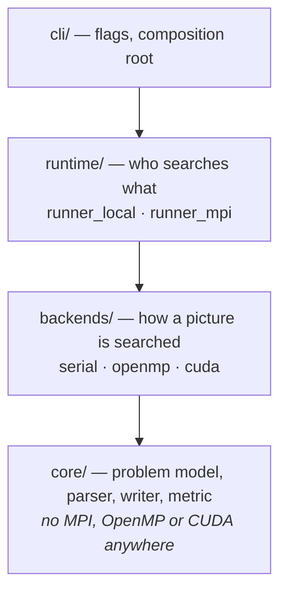

# Architecture

## The one decision everything else follows from

Two questions are independent and were originally tangled together:

- **How is a single picture searched?** — a *backend* concern (scalar C, OpenMP, CUDA).
- **Which process searches which picture?** — a *runtime* concern (one process, or MPI).

Separating them is what makes the rest of the project possible:



Each layer depends only on the one below it. `core/` compiles with a bare C
compiler; the backends add exactly one dependency each; the runtimes add MPI.
Consequences:

| Property | How it falls out |
|---|---|
| Builds anywhere | The serial backend has no dependencies, so `cmake && make` works on a laptop with nothing installed. |
| Backends are comparable | Same input, same interface, different implementation — so `--verify` can run all of them and diff the results. |
| Speedup is measurable | The serial backend is a real baseline, not an estimate. |
| Adding a backend | Implement five function pointers in `include/msearch/backend.h`; touch nothing else. |
| CI can test configurations | Every optional feature has an off switch, so "serial only" is a tested configuration, not a hope. |

## The determinism contract

Every backend must return the same answer for the same input:

> **1.** the **lowest object id** that occurs anywhere in the picture, then
> **2.** the **row-major-first placement** of that object.

Implementation:

- Objects are **sorted by ascending id when loaded** (`msearch_problem_validate`),
  so rule 1 becomes "the first matching entry in the array" and the search can
  stop at the first object that hits.
- Placements are identified by a packed key `row * span + col`. Rule 2 becomes
  a **minimum over that key** — `atomicMin` on the GPU, a guarded compare on
  the CPU — rather than "whichever thread finished first".
- The MPI runtime tags every result with its picture index and reassembles them
  in input order, so the output file does not depend on rank count or on which
  rank happened to claim which picture.

### Why not just take the first match found?

That is what the original implementation did, and it is marginally faster. It
is also unreproducible: two runs of the same binary on the same input could
report different objects and positions, because the answer depended on OpenMP
thread scheduling and CUDA block scheduling. Nothing about it could be tested,
and no two backends could be compared.

The determinism contract costs very little, because the min-reduction carries
its own early exit — any placement whose key is already ≥ the running minimum
cannot lower it and is skipped without being scored. What it buys is the entire
test suite: `tests/test_backends.c` asserts that every available backend is
**byte-identical to the serial reference** on the same problems.

## The metric is a single shared function

`include/msearch/metric.h` is compiled by both the host C compiler and `nvcc`:

```c
#if defined(__CUDACC__)
#  define MSEARCH_HD __host__ __device__ static inline
#else
#  define MSEARCH_HD static inline
#endif
```

The serial backend, the OpenMP backend and the CUDA thread-per-placement kernel
all call the same `msearch_score_at`. They are not three implementations that
ought to agree — they are one implementation compiled three ways. This is why
backend equivalence is a meaningful test rather than a tautology, and why a
change to the metric cannot drift between CPU and GPU.

### The singularity at `p == 0`

The problem defines the per-element difference as `|(p - o) / p|`, which is
undefined when a picture element is zero. This is not hypothetical: the
reference input's matrices begin at `0`, so it occurs at the **first placement
of every picture**.

Unhandled it produces `inf` (`p == 0, o != 0`) or `NaN` (`p == o == 0`), and
since both compare `false` against any threshold, genuine matches are silently
discarded. On `tests/data/reference.txt` the original code reported picture 108
matching at `(0,1)` because the true match at `(0,0)` evaluated to `NaN`.

The fix substitutes a small epsilon for a zero denominator:

| case | term | meaning |
|---|---|---|
| `p == 0, o == 0` | `0` | exact match, as it should be |
| `p == 0, o != 0` | `|o| / ε` | very large, so effectively a mismatch |

`ε` defaults to `1e-9` and is settable with `--zero-eps`, so the behaviour is a
documented, testable policy instead of undefined behaviour.
`tests/data/zero_elements.txt` and `tests/test_metric.c` pin it down.

## Early exit

Every term of the score is non-negative, so the running sum is **monotonically
increasing**: once it reaches the threshold, the placement can never match.

The check sits in `msearch_score_at`, hoisted to **once per object row** — per
element it would put a branch in the innermost loop and block vectorisation;
per placement it would give up most of the benefit.

Measured on `bench/data/large.txt` (4×2048², 4 objects of 16²), serial backend:

| | best of 3 |
|---|---|
| with early exit | **0.997 s** |
| without early exit | 16.890 s |

**16.9× for a three-line change**, with byte-identical output on every fixture
and on the benchmark input. Because it lives in the shared metric, all three
backends get it.

## CUDA design

The previous GPU path allocated device memory, uploaded the picture *and* an
object, launched, copied back and freed — **once per (picture, object) pair,
from every OpenMP thread**. With one GPU visible, `gpu_id = thread_id % 1 = 0`
meant every thread targeted the same device on the same default stream, so the
launches serialised while the picture crossed PCIe K times per picture.

The redesign:

**Persistent buffers.** `create()` uploads every object once into a single
packed allocation and preallocates a picture buffer sized for the largest
picture in the problem, plus pinned host staging. Nothing is allocated on the
hot path.

**One picture upload per search**, not per object.

**One synchronisation per picture.** All K kernels are queued on one stream and
nothing blocks until a single `cudaStreamSynchronize` and one K-int copy back.
Cross-object early exit still works: kernel *k* reads the result slots of
objects `0..k-1` and returns immediately if a lower-id object already matched.
Stream ordering makes those writes visible without a host round trip.

**Two kernel decompositions**, chosen by object area:

| Object area | Kernel | Why |
|---|---|---|
| `m² < 256` | one **thread** per placement | Adjacent threads take adjacent columns and therefore adjacent picture addresses, so loads coalesce. Each thread sums in the same order as the serial backend, making results **bit-identical**. |
| `m² ≥ 256` | one **warp** per placement, `__shfl_down_sync` reduction | A single thread walking hundreds of elements stops hiding latency. Spreading a placement across 32 lanes restores parallelism without shared memory or `__syncthreads`. |

For comparison, the original used one **block of 256 threads** per placement
plus a full shared-memory reduction — to sum the 9 elements of a 3×3 object.
About 96% of the threads had no work, and the reduction cost more than the sum.

**Every CUDA call is checked.** The original checked only the kernel launch,
then copied results back and reported them regardless.

### Floating-point reproducibility

The thread-per-placement kernel calls `msearch_score_at` and accumulates in the
same order as the CPU, so it is bit-identical. The warp kernel reduces across
lanes in a different order, so a score can differ in the last bits of the
mantissa. A placement whose true score sits within ~1 ulp of the threshold
could therefore be classified differently on the GPU than on the CPU.

This is inherent to parallel floating-point reduction, not a defect, and it is
stated rather than hidden. The GPU remains deterministic *with respect to
itself*: repeated runs of the warp kernel give identical results, because the
reduction order is fixed. Making it bit-identical to serial would mean giving
up the reduction — the wrong trade.

## MPI design

**Scheduling.** Pictures differ in size by an order of magnitude and early exit
makes even same-sized pictures differ again, so a static split leaves ranks
idle. Work is claimed dynamically — but as an **MPI-3 one-sided fetch-and-add**
on a counter hosted by rank 0, not as master/worker send-recv:

```c
MPI_Fetch_and_op(&one, &index, MPI_INT, 0, 0, MPI_SUM, win);
MPI_Win_flush(0, win);
if (index >= problem->num_pictures) break;
```

Compared with the master/worker version this replaces: rank 0 no longer sits in
a dispatch loop doing no work (previously 1 of 4 nodes computed nothing), a
claim costs one RMA instead of a round trip through a possibly-busy process,
and the program no longer refuses to run on fewer than two ranks.

**Trade-off.** Pull-based claiming requires every rank to hold the whole
problem, so peak memory is O(total input) per rank rather than O(one picture).
For inputs that fit in node memory — the regime this targets — that removes all
data movement from the hot path. Streaming would lift the limit at the cost of
reintroducing a master. This is a deliberate choice, not an oversight.

**Failure handling.** A rank that fails stops claiming work but still reaches
the collectives; healthy ranks drain the remaining indices; the failure is
combined with `MPI_Allreduce(MPI_MAX)` so every rank agrees on the outcome.
Aborting where the failure occurs would hang the other ranks in `MPI_Gather`.
Contrast the original, whose allocation failures called `exit(1)` on one rank
and left the rest blocked in `MPI_Recv` forever.

**GPU mapping.** `MPI_Comm_split_type(MPI_COMM_TYPE_SHARED)` gives each process
its rank *within its node*, and the CUDA backend maps that onto a device. N
ranks on a node drive N GPUs — the standard one-rank-per-GPU idiom, and the
correct axis for multi-GPU. Mapping OpenMP *threads* to devices, as the
original did, is the wrong axis: with one GPU it produces contention, and with
several it splits a single process's work across contexts for no gain.

## Error handling

Every fallible function returns a `Status` and takes a caller-owned message
buffer:

```c
Status msearch_read_problem(const char *path, Problem *out, char *err, size_t err_len);
```

The status says *what kind* of thing went wrong (so callers can branch), the
buffer says *exactly* what (so users can act):

```
tests/data/broken.txt:14: expected element 6 of 9 for picture 7, got 'banana'
```

The caller decides whether a failure is fatal — which matters under MPI, where
a worker's error message has to travel to rank 0 rather than being printed from
a process nobody is watching. The original returned ~14 distinct integers from
one function and printed to `stderr` from library code.

## Directory layout

```
include/msearch/     public headers — the interfaces, and where the reasoning lives
src/core/            problem model, parser, writer, logging     (no parallelism)
src/backends/        serial, openmp, cuda + the registry
src/runtime/         runner_local, runner_mpi
src/cli/             argument parsing and the composition root
tests/               unit tests, fixtures, golden output, CTest scripts
tools/gen_input.py   dataset generator with planted matches
bench/run_bench.py   benchmark harness (produces docs/PERFORMANCE.md)
scripts/slurm/       build on the login node, run under SLURM
```
