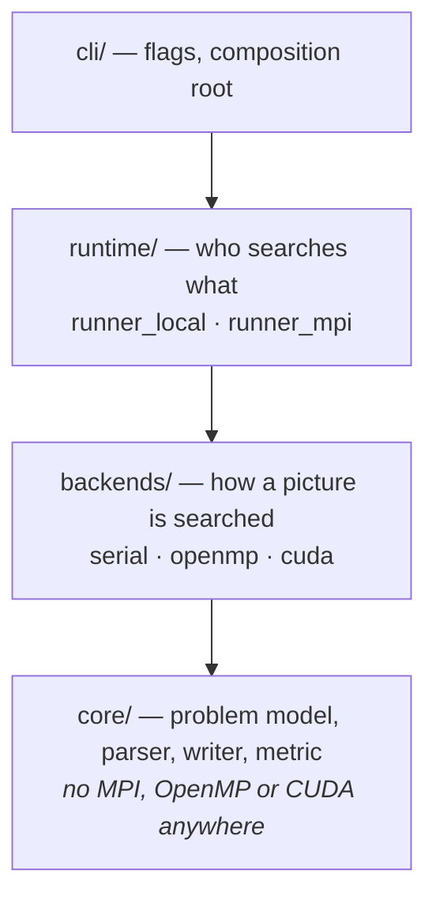

# Example 5 — hybrid object matching

> **The advanced example of [mpi-local-lab](../../README.md).** MPI across
> nodes, OpenMP or CUDA inside each rank, and results that are byte-identical
> whichever combination you pick. It was the whole project before the
> repository became an MPI environment, which is why it carries its own
> `include/`, `src/`, `tests/`, `tools/` and `bench/` rather than being a
> single `main.c` like examples 1–4.
>
> Run it across the container cluster with:
> ```bash
> ./scripts/run-mpi.sh -n 4 examples/hybrid-object-matching \
>     --backend openmp -i examples/hybrid-object-matching/tests/data/reference.txt -o -
> ```

**Find small matrices inside large ones, fast, on anything from a laptop to a
multi-node GPU cluster.**

A high-performance submatrix search with three interchangeable compute
backends — scalar C, OpenMP, CUDA — behind one interface, and two runtimes —
single process and MPI — that use them without knowing which one they hold.

```bash
cmake -S ../.. -B build && cmake --build build --parallel   # from this directory
./build/bin/msearch -i tests/data/example.txt -o -
# Picture 1 found Object 1 in Position(1,2)
```

The build is rooted at the repository, not here: toolchain detection and the
shared warning flags live in the top-level `CMakeLists.txt`, and every example
reads them. Binaries land in `build/bin/`.

---

## The problem

Given a set of **pictures** (large N×N integer matrices) and a set of
**objects** (small M×M matrices), decide for each picture whether *any* object
occurs inside it within a tolerance, and report where.

For an object placed with its top-left corner at (I, J):

$$\text{Matching}(I,J) \;=\; \sum_{y,x} \left| \frac{p_{I+y,\,J+x} - o_{y,x}}{p_{I+y,\,J+x}} \right|$$

A placement matches when `Matching(I,J) < threshold`.

**Why it is interesting.** The search space is
`pictures × objects × (N−M+1)²` placements, each costing `M²` operations — a
64-picture problem at N=2048, M=16 is billions of element evaluations. The work
per picture is wildly irregular (pictures differ in size; a match ends a search
early), which makes naive static partitioning leave processors idle. And the
metric has a singularity at `p = 0` that quietly corrupts results if unhandled.

## Example

<table>
<tr><th>Picture (6×6)</th><th>Object (3×3)</th></tr>
<tr><td><pre>
10   5  67  12   8   4
23   6   5  14   9   5
12  10  20  56   2   3
 1   2   6  10   3   2
45   3   7   5   5   2
11  43   2  54   1  12
</pre></td><td><pre>
 5  14   9
20  56   2
 6  10   3
</pre></td></tr>
</table>

```console
$ ./build/bin/msearch -i tests/data/example.txt -o -
Picture 1 found Object 1 in Position(1,2)
```

## Features

- **Three compute backends** behind one interface — `serial`, `openmp`, `cuda`
  — selectable at runtime with `--backend`, auto-detected by default.
- **Two runtimes** — single process, or MPI with dynamic work claiming — that
  produce **byte-identical output** for any rank count.
- **Deterministic by contract.** Same input ⇒ same bytes out, on every backend,
  every run. See [the contract](docs/ARCHITECTURE.md#the-determinism-contract).
- **`--verify`**: runs every available backend on the same problem and requires
  exact agreement with the serial reference.
- **Degrades gracefully.** No CUDA, no MPI, no OpenMP? It still builds and runs.
- **Runs with no toolchain at all** via the bundled Docker images — including
  [the GPU on Windows](#cuda-in-docker), with no CUDA Toolkit on the host.
- **Measured, not assumed**: a serial baseline, a seeded dataset generator, and
  a benchmark harness — see [PERFORMANCE.md](docs/PERFORMANCE.md).
- **Actionable errors**: `input.txt:14: expected element 6 of 9 for picture 7, got 'banana'`.

## Architecture

Two questions are independent, and separating them is the design:

| | |
|---|---|
| **How is one picture searched?** | a **backend** — `serial` · `openmp` · `cuda` |
| **Which process searches which picture?** | a **runtime** — `runner_local` · `runner_mpi` |



A backend implements five function pointers:

```c
typedef struct MatchBackend {
    const char *name;
    const char *description;
    bool   (*available)(char *reason, size_t reason_len);
    Status (*create)(const Problem *, const Config *, void **ctx, char *err, size_t);
    Status (*search)(void *ctx, const Picture *, Match *out, char *err, size_t);
    void   (*destroy)(void *ctx);
} MatchBackend;
```

`available()` is a *runtime* probe, not a compile-time flag — the CUDA backend
is compiled in but unavailable when no device is visible, and `--backend auto`
falls through to the next one. `create()` is where expensive reusable work
belongs: the CUDA backend uploads every object to the device exactly once
there.

Full reasoning, including the CUDA and MPI designs and the trade-offs behind
them, is in **[docs/ARCHITECTURE.md](docs/ARCHITECTURE.md)**.

## Technologies

C11 · CUDA · MPI-3 (one-sided RMA) · OpenMP · CMake · CTest · GitHub Actions ·
SLURM · Python (tooling)

## Project structure

Within this example (`examples/hybrid-object-matching/`):

```
include/msearch/     public headers — the interfaces, and the reasoning
  backend.h            the backend contract + determinism rules
  metric.h             the matching metric, compiled for host AND device
src/core/            problem model, parser, writer, logging   (no parallelism)
src/backends/        serial · openmp · cuda · registry
src/runtime/         runner_local · runner_mpi
src/cli/             argument parsing, composition root
tests/               unit tests, fixtures, golden output, CTest scripts
tools/gen_input.py   dataset generator with planted matches
bench/run_bench.py   benchmark harness
docs/                ARCHITECTURE.md · PERFORMANCE.md
Makefile             a CMake-free build, for login nodes without it
```

At the repository root, and shared with every other example:

```
CMakeLists.txt       toolchain detection; this example is one add_subdirectory
Dockerfile           CPU:  builder → dev (a cluster node) → runtime (this binary)
Dockerfile.cuda      GPU:  the same, plus CUDA
compose.yaml         the container cluster
scripts/slurm/       build on the login node, run under SLURM
```

## Install and run

**Requirements:** a C11 compiler and CMake ≥ 3.18. Everything else is optional
and detected automatically. Prefer not to install anything? Skip to
[With Docker](#with-docker).

```bash
cmake -S ../.. -B build -DCMAKE_BUILD_TYPE=Release
cmake --build build --parallel
ctest --test-dir build --output-on-failure
```

The configure step reports what it found:

```
  OpenMP     : TRUE
  MPI        : TRUE
  CUDA       : /usr/local/cuda/bin/nvcc
```

No CMake? `make` builds the same sources with the same detection.

### Usage

```console
$ ./build/bin/msearch --list-backends
BACKEND   STATUS       DESCRIPTION
cuda      available    NVIDIA GPU (CUDA, persistent buffers, one thread per placement)
openmp    available    multicore CPU (OpenMP, parallel over placements)
serial    available    single-threaded reference implementation
```

```bash
./build/bin/msearch -i input.txt -o output.txt          # auto-select the best backend
./build/bin/msearch --backend openmp --threads 8        # pin the backend and thread count
./build/bin/msearch --verify -i tests/data/planted.txt  # cross-check every backend
./build/bin/msearch --backend serial --bench 5          # timing, min/median/mean/max
mpirun -n 4 ./build/bin/msearch --backend cuda -i big.txt
```

```console
$ ./build/bin/msearch --verify -i tests/data/planted.txt
reference: serial (3 pictures)
  openmp   OK (identical to serial)
  cuda     OK (identical to serial)
```

### With Docker

Two images. Both run the full test suite during `docker build`, so a broken
commit cannot produce a usable one. Native CMake builds remain fully supported —
Docker is an alternative, not a replacement.

| File | Image | Backends |
|---|---|---|
| `Dockerfile` | CPU | serial, OpenMP, MPI |
| `Dockerfile.cuda` | GPU | serial, OpenMP, MPI **and CUDA** |

#### CPU image

```bash
# 1. Build (runs the full test suite during the build)
docker build -t msearch .

# 2. Serial
docker run --rm msearch msearch --backend serial -i tests/data/example.txt -o -

# 3. OpenMP
docker run --rm msearch msearch --backend openmp --threads 4 \
    -i tests/data/reference.txt -o -

# 4. MPI — four ranks inside the container
docker run --rm msearch mpirun -n 4 --oversubscribe \
    msearch --backend serial -i tests/data/reference.txt -o -
```

All three produce identical output, which is the point.

The **test suite runs during `docker build`**, so a broken commit cannot produce
a usable image. To run it again on demand, build the builder stage and invoke
CTest in it:

```bash
docker build --target builder -t msearch-test .
docker run --rm -e OMPI_ALLOW_RUN_AS_ROOT=1 -e OMPI_ALLOW_RUN_AS_ROOT_CONFIRM=1 \
    msearch-test ctest --test-dir build --output-on-failure
```

To work on your own data, mount a directory:

```bash
docker run --rm -v "$PWD/data:/data" msearch \
    msearch --backend openmp -i /data/problem.txt -o /data/results.txt
```

Notes:

- The image runs as an unprivileged user, because `mpirun` refuses to run as
  root and nothing here needs it.
- `--oversubscribe` lets you request more ranks than the container has cores.
  Dropping it is fine when ranks ≤ cores.
- **Combining MPI and OpenMP:** each rank divides the node's cores by the
  number of ranks sharing it, so `mpirun -n 4` on 16 cores gives 4 threads per
  rank rather than 16. Without that, the four ranks would spawn 64 threads
  between them — measured at **14× slower** on the reference input. `--threads`
  and `OMP_NUM_THREADS` both override the default.
- The CPU image has no CUDA. For the GPU, use `Dockerfile.cuda` below.

### CUDA in Docker

`Dockerfile.cuda` builds on the official `nvidia/cuda` base and contains the
whole CUDA development and runtime environment. **You do not need a CUDA
Toolkit on your host** — not in Windows, not in your WSL distro. A recent
NVIDIA driver is the only host requirement.

#### What you need (Windows)

1. **Windows 10 (21H2+) or Windows 11**
2. **WSL2 enabled** — `wsl --install`, then `wsl --set-default-version 2`
3. **Docker Desktop** configured to use the **WSL2 backend**
   (Settings → General → *Use the WSL 2 based engine*)
4. **A supported NVIDIA GPU** (Maxwell or newer; this was tested on an RTX 3050)
5. **An NVIDIA Windows driver with WSL2/CUDA support** — any recent driver
   (≥ 527.41) works. Install it *on Windows*, not inside WSL, and do **not**
   install a Linux driver in the distro.
6. Nothing else. Docker Desktop supplies the container runtime, and the image
   supplies `nvcc`, the CUDA runtime and every library.

On native Linux the equivalent requirement is the NVIDIA driver plus the
[NVIDIA Container Toolkit](https://docs.nvidia.com/datacenter/cloud-native/).

#### Check Docker can see the GPU first

Before building anything in this repository, confirm the plumbing works:

```bash
docker run --rm --gpus all nvidia/cuda:12.4.1-base-ubuntu22.04 nvidia-smi
```

A table listing your GPU means you are ready. `could not select device driver`
or `unknown flag: --gpus` means step 3 or 5 above is not in place — fix that
before going further, because every failure after this point will look like a
problem with this project instead.

#### Build and run

```bash
# Build (the CPU test suite runs inside; the GPU is not needed to build)
docker build -f Dockerfile.cuda -t msearch:cuda .

# CUDA now reports itself available
docker run --rm --gpus all msearch:cuda msearch --list-backends

# Cross-check the GPU against the serial reference — do this before trusting
# any GPU result or timing
docker run --rm --gpus all msearch:cuda msearch --verify -i tests/data/reference.txt

# All four backends, in the one image
docker run --rm --gpus all msearch:cuda msearch --backend serial -i tests/data/example.txt -o -
docker run --rm --gpus all msearch:cuda msearch --backend openmp -i tests/data/example.txt -o -
docker run --rm --gpus all msearch:cuda msearch --backend cuda   -i tests/data/example.txt -o -
docker run --rm --gpus all msearch:cuda mpirun -n 3 --oversubscribe \
    msearch --backend cuda -i tests/data/reference.txt -o -
```

```console
$ docker run --rm --gpus all msearch:cuda msearch --list-backends
BACKEND   STATUS       DESCRIPTION
cuda      available    NVIDIA GPU (CUDA, persistent buffers, one thread per placement)
openmp    available    multicore CPU (OpenMP, parallel over placements)
serial    available    single-threaded reference implementation

$ docker run --rm --gpus all msearch:cuda msearch --verify -i tests/data/reference.txt
[info ] cuda backend: device 0 (NVIDIA GeForce RTX 3050 4GB Laptop GPU, 20 SMs)
reference: serial (10 pictures)
  cuda     OK (identical to serial)
  openmp   OK (identical to serial)
```

Notes:

- **Forget `--gpus all` and nothing breaks.** The CUDA backend reports itself
  unavailable with a reason, and `--backend auto` falls through to OpenMP. That
  is the same graceful-degradation path CI relies on.
- **CUDA 12.4 on Ubuntu 22.04**, chosen for driver reach rather than novelty:
  CUDA's minor-version compatibility means a 12.4 binary runs on any driver
  supporting 12.x, so the image works on drivers back to late 2022. Override
  with `--build-arg CUDA_VERSION=…` if you need a different one.
- **GPU architectures** are Pascal through Hopper as real code, plus PTX from
  `sm_90` so newer GPUs still work by JIT. Override with
  `--build-arg CUDA_ARCHITECTURES="86-real"` to cut build time to one target.
- The image builds fine **without** a GPU — `docker build` cannot access one
  anyway — so CI can build it on a GPU-less runner.

### On the local container cluster

Four simulated MPI nodes, no cluster account required — this is what the rest
of the repository is for:

```bash
./scripts/start-cluster.sh 4
./scripts/run-mpi.sh -n 4 examples/hybrid-object-matching \
    --backend openmp -i examples/hybrid-object-matching/tests/data/reference.txt -o -
```

The output is byte-identical to a single process, which is the point. See the
[root README](../../README.md).

### On a real cluster

Run from the repository root:

```bash
scripts/slurm/build.sh                  # build once, on the login node
sbatch scripts/slurm/submit.sbatch
```

[docs/REAL_CLUSTER.md](../../docs/REAL_CLUSTER.md) covers what transfers and
what does not.

### Input format

A whitespace-separated token stream; `#` comments run to end of line:

```
1.0          # threshold
1            # picture count
1  6         # picture id, size
  10   5  67  12   8   4
  ...
1            # object count
1  3         # object id, size
   5  14   9
  ...
```

Generate one:

```bash
python tools/gen_input.py --pictures 8 --picture-size 512 --objects 4 \
                         --object-size 16 --seed 7 -o problem.txt
```

It records the planted positions as comments, so the expected answer is written
into the file — which is what makes it useful for both tests and benchmarks.

## Important technical decisions

**Determinism over "first match wins".** The obvious implementation returns
whichever match a thread reaches first and bails. It is marginally faster and
completely untestable: results vary run to run with thread scheduling. Instead
the answer is *defined* — lowest object id, then row-major-first placement —
and implemented as a minimum over a packed placement key (`atomicMin` on GPU).
The min-reduction carries its own early exit, so the cost is small; what it
buys is that three independent backends can be asserted byte-identical.

**One metric, compiled three ways.** `include/msearch/metric.h` is compiled by
both the host compiler and `nvcc`. The serial backend, the OpenMP backend and
the CUDA thread-per-placement kernel call the *same function*. They are not
three implementations that ought to agree — they are one implementation, which
is why "the backends match" is a meaningful test rather than a tautology.

**A defined answer at `p = 0`.** `|(p−o)/p|` is undefined when a picture
element is zero, which in the reference input happens at the first placement of
*every picture*. Unhandled it yields `inf` or `NaN`, both of which compare
false against the threshold, so real matches vanish silently. Substituting a
small epsilon makes `p = o = 0` an exact match and `p = 0, o ≠ 0` a strong
mismatch. Tunable via `--zero-eps`; pinned down by `tests/data/zero_elements.txt`.

**A serial backend nobody will run in production.** It exists to be the ground
truth for `--verify` and the denominator for every speedup number. Without it,
"3.8× faster" is an unfalsifiable claim.

**Pull-based MPI scheduling, and what it costs.** Ranks claim pictures with an
MPI-3 `MPI_Fetch_and_op` on a shared counter, so every rank computes and there
is no scheduler process. The price is that each rank holds the whole problem
(O(total input) memory, not O(one picture)). For inputs that fit in node
memory that removes all data movement from the hot path — a deliberate trade,
documented rather than discovered.

## Engineering challenges worth calling out

**The parallelism was decorative.** The original parallelised over *objects*
(a dozen) rather than *placements* (millions), guarded a shared flag with a
critical section on **every** iteration, and had each OpenMP thread issue
blocking CUDA calls. With one GPU visible, `thread_id % 1` mapped all threads
to device 0 on the default stream — which serialises against itself. Eight
threads produced zero concurrency while re-uploading the same picture twelve
times. Diagnosing *why* a three-level hybrid ran no faster than one level was
the most interesting part of this project.

**Aborting is contagious in MPI.** The original called `exit(1)` on allocation
failure; one rank left and every other rank blocked forever in `MPI_Recv`. The
fix is that failures propagate through the collectives — a failing rank stops
claiming work but still reaches the barrier, healthy ranks drain the remainder,
and `MPI_Allreduce(MPI_MAX)` makes all ranks agree on the outcome.

**Early exit is worth more than the GPU.** Because every term is non-negative,
the partial sum is monotone: a placement can be abandoned the moment it reaches
the threshold. Three lines, hoisted to once per object row (per element it
blocks vectorisation; per placement it gives up the benefit) — **16.9× on the
serial backend**, byte-identical output. It sits in the shared metric, so every
backend gets it. Reaching for a GPU before finding this would have optimised
the wrong thing.

**The GPU kernel that made things slower.** The first working CUDA backend was
**3.7× slower than one CPU core**. It was correct — `--verify` passed — and
still a net loss. The cause was a warp-per-placement kernel used for larger
objects: spreading a placement across 32 lanes means every lane must contribute
before the sum can be tested, so it could never stop early. It had quietly
traded a ~17× algorithmic win for at most a 32× lane count on work that early
exit was already eliminating. Deleting it gave **15.9×** and turned the GPU
into a 5.19× win, removed 45 lines and a tunable, and — since only one
summation order survives — made every CUDA result bit-identical to serial.
It lost at every object size and threshold tested, so there was nothing to
keep. Full measurements in
[ARCHITECTURE.md](docs/ARCHITECTURE.md#one-kernel-not-two).

**Making a race testable.** Nothing here could be regression-tested until the
output stopped depending on thread scheduling. The determinism contract came
first; the test suite became possible afterwards.

## Testing

```console
$ ctest --test-dir build --output-on-failure -R 'test_|golden|equivalence'
    Start 1: test_metric        Passed
    Start 2: test_parser        Passed
    Start 3: test_options       Passed
    Start 4: test_backends      Passed
    Start 5: cli_golden_output  Passed
    Start 6: mpi_equivalence    Passed
```

Without the `-R` filter, `ctest` also runs the rank sweeps of examples 1–4,
since the build is rooted at the repository.

| Test | What it protects |
|---|---|
| `test_metric` | metric values, the `p = 0` policy, and that early exit never changes a match decision |
| `test_parser` | both input layouts, and that each malformed input produces the right error *and* location |
| `test_options` | argument parsing (a pure function — it reports requests instead of printing and exiting) |
| `test_backends` | **backend equivalence**: every available backend byte-identical to serial; both determinism rules; repeat-run stability; degenerate shapes |
| `cli_golden_output` | end-to-end CLI against committed golden files |
| `mpi_equivalence` | 1–4 ranks produce output identical to a single process |

CI builds three configurations — serial-only, OpenMP, OpenMP+MPI — with
`-Werror`, compiles the CUDA backend separately, and runs `clang-format` and
`cppcheck`. "Serial only" is a *tested* configuration, so the claim that this
builds without a cluster is checked on every push.

## Performance

Measured on an Intel i7-1360P laptop; full method and caveats in
**[docs/PERFORMANCE.md](docs/PERFORMANCE.md)**.

**Early exit**, serial backend, 66.1 M placements:

| | Best of 3 |
|---|---|
| with early exit | **0.997 s** |
| without | 16.890 s → **16.9× slower** |

**CPU scaling**, same workload:

| Backend | Threads | Best (s) | Speedup |
|---------|---------|----------|---------|
| serial  | –  | 0.9693 | 1.00× |
| openmp  | 1  | 1.0150 | 0.95× |
| openmp  | 2  | 0.5763 | 1.68× |
| openmp  | 4  | 0.3373 | 2.87× |
| openmp  | 8  | 0.2532 | 3.83× |
| openmp  | 16 | 0.2102 | 4.61× |

The single-thread *regression* (0.95×) is the honest cost of the parallel
region. Scaling flattens past 4 threads because this CPU has 4 performance
cores and 8 efficiency cores, and because the kernel is closer to
memory-bandwidth-bound than compute-bound after early exit.

**GPU**, measured separately inside the CUDA container on an RTX 3050 (the CPU
figures above are native Windows, so only compare within a table):

| Backend | Best of 5 (s) | Speedup |
|---------|---------------|---------|
| serial  | 1.4009 | 1.00× |
| openmp (16) | 0.8320 | 1.68× |
| cuda    | **0.2701** | **5.19×** |

Repeating the batch under different machine load moved the CPU numbers by
19–27% but the GPU by 0.2%, so the defensible claim is **~5–6× over one CPU
core**, not 5.19× to four figures. And that sits *on top of* the 16.9× early
exit, not instead of it — measured against an unoptimised baseline the same GPU
would have scored 88×, and the number would have meant nothing.

## Limitations

- **Every MPI rank holds the whole problem.** Peak memory is O(total input) per
  rank. Deliberate (see above), but it bounds the input size to what fits in
  node memory.
- **GPU results are from one consumer laptop card** (RTX 3050, 20 SMs). A
  datacentre GPU would shift the ratio; the correctness guarantee is unaffected.
- **One match per picture.** Reporting the first occurrence is the problem
  specification, not a limitation of the search — but `--report-all` does not
  exist yet.
- **Matrices must be square** and `int`-valued, as specified.
- **Objects are re-searched per picture.** No cross-picture index or
  preprocessing (see below).

## Future improvements

- **CPU/GPU co-execution** — split each object's placement range between the
  CUDA stream and OpenMP threads, tuned by a `--hybrid-split` fraction, so a
  GPU node's CPUs are not idle. Deliberately left out for now: it is the one
  feature that could not be tested without a device, and untested complexity is
  worse than none.
- **Streaming MPI mode** for problems larger than node memory, restoring
  push-based distribution behind the same runtime interface.
- **Algorithmic pruning.** The current search is exhaustive. A summed-area
  table over the picture would give an O(1) block-sum lower bound per
  placement, rejecting most candidates without touching M² elements — likely a
  larger win than any further tuning.
- **Multi-GPU per rank**, for the case where one rank must drive several
  devices instead of the standard one-rank-per-GPU mapping.
- **`--report-all`** to emit every occurrence instead of the canonical first.

## License

MIT — see [LICENSE](LICENSE).
